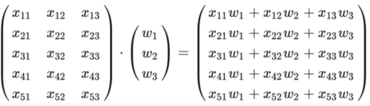
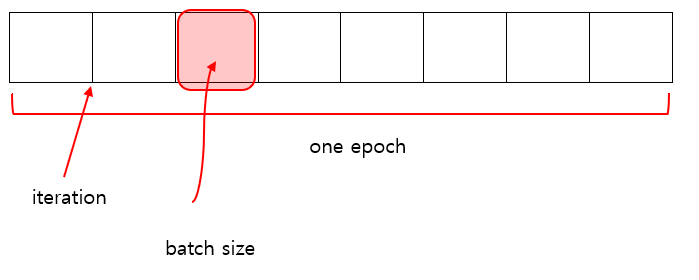
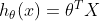

해당 글은 edwith의 '텐서플로우로 시작하는 딥러닝'을 수강하면서 정리한 것입니다. 
자세한 설명이 아닌 주요 용어와 개념 위주로 정리하였습니다.

## Multi-Variable Linear Regression
* **손실함수 (cost function)**

  우리가 세운 가설과 실제 값의 차이를 나타내는 함수, loss function이라고도 함
* **머신러닝의 목표/목적**

  - 손실함수를 최소화하는 W(가중치, 모수)를 찾는 것이 머신러닝의 시발점
  - W를 조정해 나가는 것이 학습을 한다는 의미
  - 머신러닝의 목표는 손실함수를 최소로 하는 W값을 찾아내는 것이라 할 수 있음
* **다변량 선형 회귀분석의 가설과 비용함수**

**_Hypothesis_**

   
**_Cost Function_**
  

***

변수가 많아지면 식을 다 쓰기 어려워지게 되므로 행렬을 사용하여 연산  
이때, weight와 feature값들의 점곱(스칼라 곱셉)이 이루어짐 (행렬의 곱셈)

__H(X) = XW__

  
실제 데이터 X 가중치 (weight) = 우리의 가설 H(x)  
 

***
* 주요 용어  

|변수 기호 | 변수 이름 |
|---|---|
| X | 입력변수, feature, 독립변수, 설명변수, input |
| Y | 출력변수, label, 반응변수, 종속변수, output |

관측치 = OBS(Observation) = 데이터 = 인스턴스  

| 용어 | 의미 |
|:------------------:|-----------------------------|
|1 epoch| 전체 데이터 셋을 한번에 학습 , 전체 데이터 셋에 대해 한번 학습을 완료한 상태 |
|iteration| 메모리의 한계와 속도 저하 때문에 대부분의 경우에는 한번의 epoch에서 모든 데이터 셋을 학습시키기 어려움. 따라서, 데이터를 나누어서 학습시키게 되는데 이 때 몇 번 나눠주는가를 iteration이라고 함 |
|batch size| 각 iteration마다 주는 데이터 사이즈 |
|mini-batch| 데이터 일부, 데이터 모음, 데이터 셋을 batch size로 쪼개서 학습 |
|Full-batch| 데이터 전체 |

## Logistic Regression / Classification

* Binary Classification 
   
  입력변수 (데이터)를 토대로 두가지 케이스로 분류하는 것
* Logistic vs Linear 

  로지스틱은 출력변수를 두가지 경우로 분류하는 데 목적이 있다면, 회귀는 값을 예측하는 데 있음  
  Discrete (counted) vs Continous (measured)   

### Logistic

어느 한 데이터 분석가가 공부한 시간에 따라 시험 합격 여부를 예측하는 모델링을 하려고 한다.

