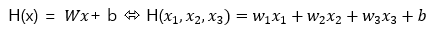
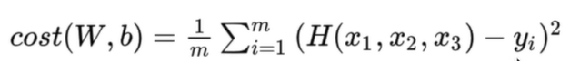

해당 글은 edwith의 '텐서플로우로 시작하는 딥러닝'을 수강하면서 정리한 것입니다. 
자세한 설명이 아닌 주요 용어와 개념 위주로 정리하였습니다.

# Multi-Variable Linear Regression
* **손실함수 (cost function)**

  우리가 세운 가설과 실제 값의 차이를 나타내는 함수, loss function이라고도 함
* **머신러닝의 목표/목적**

  - 손실함수를 최소화하는 W(가중치, 모수)를 찾는 것이 머신러닝의 시발점
  - W를 조정해 나가는 것이 학습을 한다는 의미
  - 머신러닝의 목표는 손실함수를 최소로 하는 W값을 찾아내는 것이라 할 수 있음
* **다변량 선형 회귀분석의 가설**

**_Hypothesis_**

   
   **_Cost Function_**
  

